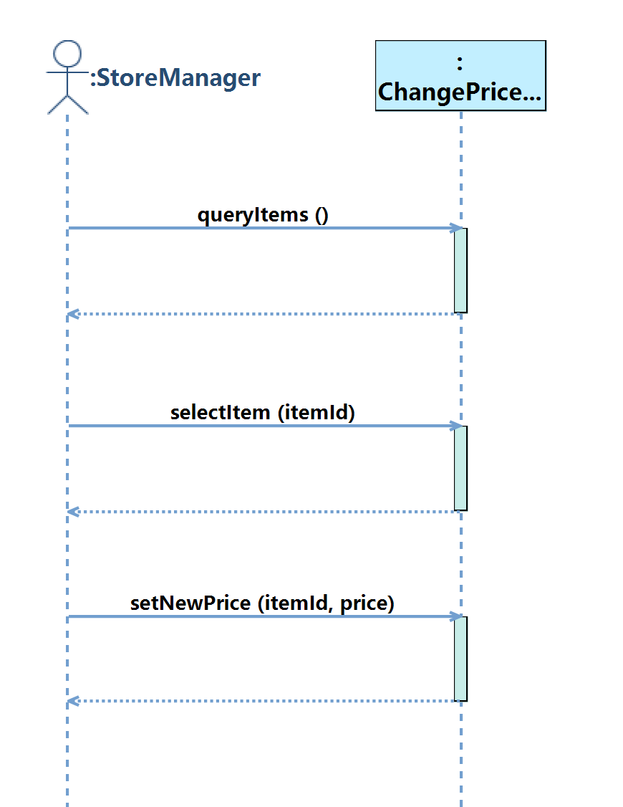
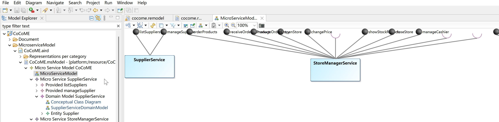

# 软件需求分析与系统设计

[toc]

__TOC__


# Lab 01

## 一、项目选取与准备工作

1、本项目选取在COCOME超时管理系统中扩展
2、安装工具及环境 https://ai4se.com/downloads/
3、阅读作业相关指南：https://ai4se.com/tutorial/user/create_requirements_model/


## 二、结构化自然语言建模
按照项目结构，在RequirementDescription文件夹下新建在xxx.re文件，用结构化的自然语言描述需求。按照角色，用分为了`administrator.re`、`casher.re`、`storManager.re`三个文件，一共`10`条需求用例。


举例管理员的用例， 写了 add catalog 、 manage store 和 manage cashier 三个用例。 其中 add catalog 编写了基本的处理流程，说明了用户和系统分别应该在何时做哪些动作。


## 三、UML需求建模

#### 1、根据结构化的自然语言需求模型，画出对应的用例图


#### 2、为具体用例画出系统时序图

对用例的处理步骤进行拆解，以店铺管理员【向供应商订货】  和 【商品改价】  两个用例为例。

向供应商订货包括

- 选择供应商
- 选择要订货的商品
- 设置要订货的数量
- 提交订单

一共4个主要步骤。 


商品改价包括

- 查询当前在售商品列表
- 选取要改价的商品
- 进行改价

三个主要步骤，其中后两个可以循环进行



#### 3、为系统操作设置OCL合约

OCL合约，写在cocome.remodel文件中，应该放置在**Service**定义的后面。 一个OCL包含 

- 定义：definition ，操作的对象、参数等的定义。
- 前置条件：precondition。 执行操作前各个对象应该满足的条件。
- 后置条件：postcondition。 正确执行完操作后 各个对象应该满足的条件。

3部分组成


#### 4、为领域模型画出类图

下图展示了COCOME系统的概念类图， 蓝色背景的为概念类，包含类目和属性，以及属性的数据类型，绿色背景的为枚举类，包含具体的枚举值。类图还展示了类与类之间的关系。


## 四、UML原型化与需求确认

使用工具自动生成原型系统，并配置maven编译执行该原型。

执行显示库存报告用例成功。


进行改价用例测试，随意输入barcode，提示前置检测失败。


# Lab 02

## 一、**架构设计自动生成**

### 1、Generate Remodeltoreq Code


会生成cocome.req文件， 部分内容如下

```java

UseCaseModel CoCoME { UseCaseContext CashierService { UC :: closeCashDesk() @Description( "The cashier closes cash desk" ) UC :: processSale() definedBySSD(ProcessSaleSSD) relatedService(ProcessSaleService) @Description( "The cashier checks out items" ) UC :: openCashDesk() @Description( "The cashier opens cash desk" ) } UseCaseContext StoreManagerService { UC :: orderProducts() definedBySSD(OrderProductsSSD) relatedService(OrderProductsService) @Description( "The store manager places an order for purchase" ) UC :: listSuppliers() @Description( "The store manager views all suppliers" ) UC :: openStore() @Description( "The store manager opens the store" ) UC :: changePrice() definedBySSD(ChangePriceSSD) relatedService(ChangePriceService) @Description( "The store manager changes the price of item" ) UC :: receiveOrderedProduct() @Description( "The store manager receives the order for purchase" ) UC :: showStockReports() @Description( "The store manager views the stock report" ) UC :: closeStore() @Description( "The store manager closes the store" ) } UseCaseContext AdministratorService { UC :: manageCashier() @Description( "The administrator manages cashier information, including entering, inquiring, modifying and deleting of cashier information" ) UC :: manageSupplier() @Description( "The administrator manages supplier information, including entering, inquiring, modifying and deleting of supplier information" ) UC :: manageStore() @Description( "The administrator manages store information, including entering, inquiring, modifying and deleting of store information" ) UC :: manageCashDesk() @Description( "The administrator manages cash desk information, including entering, inquiring, modifying and deleting of cash desk information" ) UC :: manageProductCatalog() @Description( "The administrator manages catalogues of items, including entering, inquiring, modifying and deleting of catalogue information" ) UC :: manageItem() @Description( "The administrator manages item information, including entering, inquiring, modifying and deleting of item information" ) }

	Actor Cashier("Cashier") {
		@Description( "The cashier is responsible for opening or closing the cash desk and the checkout of items") processSale
		openCashDesk
		closeCashDesk
	}

	Actor StoreManager("StoreManager") {
		@Description( "The store manager is responsible for procurement and price setting of items,and opening or closing the store") orderProducts
		receiveOrderedProduct
		showStockReports
		changePrice
		listSuppliers
		openStore
		closeStore
	}

	Actor Administrator("Administrator") {
		@Description( "The system administrator is responsible for managing information, including store information, cash desk information, cashier information, item information, item catalogue information and supplier information") manageStore
		manageProductCatalog
		manageCashDesk
		manageCashier
		manageItem
		manageSupplier
	}

	Interaction ProcessSaleSSD {

		[Participants: Cashier ProcessSaleService]

		CallMessage::makeNewSale(makeNewSale makeNewSaleSender->makeNewSaleStart)
		ReturnMessage::makeNewSaleReturn(makeNewSaleFinish->makeNewSaleReturnReceiver makeNewSale)
		CallMessage::enterItem(enterItem enterItemSender->enterItemStart)
		ReturnMessage::enterItemReturn(enterItemFinish->enterItemReturnReceiver enterItem)
		CallMessage::endSale(endSale endSaleSender->endSaleStart)
		ReturnMessage::endSaleReturn(endSaleFinish->endSaleReturnReceiver endSale)
		CallMessage::makeCashPayment(makeCashPayment makeCashPaymentSender->makeCashPaymentStart)
		ReturnMessage::makeCashPaymentReturn(makeCashPaymentFinish->makeCashPaymentReturnReceiver makeCashPayment)
		CallMessage::makeCardPayment(makeCardPayment makeCardPaymentSender->makeCardPaymentStart)
		ReturnMessage::makeCardPaymentReturn(makeCardPaymentFinish->makeCardPaymentReturnReceiver makeCardPayment)

		Execution::makeNewSale(ProcessSaleService makeNewSaleStart makeNewSaleFinish)
		Execution::enterItem(ProcessSaleService enterItemStart enterItemFinish)
		Execution::endSale(ProcessSaleService endSaleStart endSaleFinish)
		Execution::makeCashPayment(ProcessSaleService makeCashPaymentStart makeCashPaymentFinish)
		Execution::makeCardPayment(ProcessSaleService makeCardPaymentStart makeCardPaymentFinish)

		CombinedFragment::enterItemLoop->loop {

			[Participants: Cashier ProcessSaleService]

			enterItemLoopStart->enterItemLoopFinish

			Operand::hasMoreItems(hasMoreItemsStart enterItemLoopFinish)
		}

		CombinedFragment::paymentMethodAlt->alt {

			[Participants: Cashier ProcessSaleService]

			PaymentMethodAltStart->PaymentMethodAltFinish

			Operand::cash(CashStart CardStart)
			Operand::card(CardStart PaymentMethodAltFinish)
		}

		MessageEnd::makeNewSaleSender(Cashier makeNewSale)
		ExecutionEnd::makeNewSaleStart(ProcessSaleService makeNewSale)
		ExecutionEnd::makeNewSaleFinish(ProcessSaleService makeNewSale)
		MessageEnd::makeNewSaleReturnReceiver(Cashier makeNewSaleReturn)
		CombinedFragmentEnd::enterItemLoopStart(enterItemLoop)
		OperandEnd::hasMoreItemsStart(hasMoreItems)
		MessageEnd::enterItemSender(Cashier enterItem)
		ExecutionEnd::enterItemStart(ProcessSaleService enterItem)
		ExecutionEnd::enterItemFinish(ProcessSaleService enterItem)
		MessageEnd::enterItemReturnReceiver(Cashier enterItemReturn)
		CombinedFragmentEnd::enterItemLoopFinish(enterItemLoop)
		MessageEnd::endSaleSender(Cashier endSale)
		ExecutionEnd::endSaleStart(ProcessSaleService endSale)
		ExecutionEnd::endSaleFinish(ProcessSaleService endSale)
		MessageEnd::endSaleReturnReceiver(Cashier endSaleReturn)
		CombinedFragmentEnd::PaymentMethodAltStart(paymentMethodAlt)
		OperandEnd::CashStart(cash)
		MessageEnd::makeCashPaymentSender(Cashier makeCashPayment)
		ExecutionEnd::makeCashPaymentStart(ProcessSaleService makeCashPayment)
		ExecutionEnd::makeCashPaymentFinish(ProcessSaleService makeCashPayment)
		MessageEnd::makeCashPaymentReturnReceiver(Cashier makeCashPaymentReturn)
		OperandEnd::CardStart(card)
		MessageEnd::makeCardPaymentSender(Cashier makeCardPayment)
		ExecutionEnd::makeCardPaymentStart(ProcessSaleService makeCardPayment)
		ExecutionEnd::makeCardPaymentFinish(ProcessSaleService makeCardPayment)
		MessageEnd::makeCardPaymentReturnReceiver(Cashier makeCardPaymentReturn)
		CombinedFragmentEnd::PaymentMethodAltFinish(paymentMethodAlt)

	}

```

### 2、Generate Inital MicroService Model

调整了类图和用例图， 划分了4个Service。


### 3、Generate MicroService Model

生成微服务模型如下




## 二、**面向对象详细设计自动生成**

生成的DesignModel如下： 类图和服务的时序图


## 三、**大模型生成设计模型与微服务拆分**

### 1、模型选择：claude 3.7

### 2、提示词

```
我有一些用UC（用例）描述的需求如下：

UC::processSale() definedBySSD(ProcessSaleSSD) relatedService(ProcessSaleService) @Description( "The cashier checks out items" )
UC::openCashDesk() @Description( "The cashier opens cash desk" )
UC::closeCashDesk() @Description( "The cashier closes cash desk" )
UC::orderProducts() definedBySSD(OrderProductsSSD) relatedService(OrderProductsService) @Description( "The store manager places an order for purchase" )
UC::receiveOrderedProduct() @Description( "The store manager receives the order for purchase" )
UC::showStockReports() @Description( "The store manager views the stock report" )
UC::changePrice() definedBySSD(ChangePriceSSD) relatedService(ChangePriceService) @Description( "The store manager changes the price of item" )
UC::listSuppliers() @Description( "The store manager views all suppliers" )
UC::openStore() @Description( "The store manager opens the store" )
UC::closeStore() @Description( "The store manager closes the store" )
UC::manageStore() @Description( "The administrator manages store information, including entering, inquiring, modifying and deleting of store information" )
UC::manageProductCatalog() @Description( "The administrator manages catalogues of items, including entering, inquiring, modifying and deleting of catalogue information" )
UC::manageCashDesk() @Description( "The administrator manages cash desk information, including entering, inquiring, modifying and deleting of cash desk information" )
UC::manageCashier() @Description( "The administrator manages cashier information, including entering, inquiring, modifying and deleting of cashier information" )
UC::manageItem() @Description( "The administrator manages item information, including entering, inquiring, modifying and deleting of item information" )
UC::manageSupplier() @Description( "The administrator manages supplier information, including entering, inquiring, modifying and deleting of supplier information" )

现需要你根据以上用例来生成相应的微服务设计，输出应包含两部分内容：
1、类图，可以用mermaid方式输出
2、微服务设计，说明有哪些服务，服务内部有哪些接口方法等
```

### 3、模型输出


# 超市管理系统微服务设计

根据您提供的用例描述，我将为您设计一个超市管理系统的微服务架构。

## 1. 类图设计

以下是使用Mermaid语法的类图：


## 2. 微服务设计

根据用例分析，我将系统划分为以下几个微服务：

### 1. 销售服务 (Sales Service)

负责处理与销售相关的操作，包括收银台操作和销售处理。

**接口方法：**
- `processSale(saleData)`: 处理销售交易
- `openCashDesk(cashDeskId)`: 开启收银台
- `closeCashDesk(cashDeskId)`: 关闭收银台
- `getSaleHistory(params)`: 获取销售历史
- `getSaleDetails(saleId)`: 获取销售详情

**内部组件：**
- 销售处理器 (SaleProcessor)
- 收银台管理器 (CashDeskManager)
- 销售数据存储 (SaleRepository)

### 2. 库存服务 (Inventory Service)

负责管理商品库存、价格变更和库存报告。

**接口方法：**
- `getItemDetails(itemId)`: 获取商品详情
- `updateItemStock(itemId, quantity)`: 更新商品库存
- `changePrice(itemId, newPrice)`: 更改商品价格
- `getStockReport(params)`: 获取库存报告
- `searchItems(criteria)`: 搜索商品

**内部组件：**
- 商品管理器 (ItemManager)
- 价格管理器 (PriceManager)
- 库存报告生成器 (StockReportGenerator)
- 商品数据存储 (ItemRepository)

### 3. 订单服务 (Order Service)

负责处理商品订购和接收。

**接口方法：**
- `orderProducts(orderData)`: 下订单购买商品
- `receiveOrderedProduct(orderId)`: 接收已订购商品
- `getOrderDetails(orderId)`: 获取订单详情
- `getOrderHistory(params)`: 获取订单历史
- `cancelOrder(orderId)`: 取消订单

**内部组件：**
- 订单处理器 (OrderProcessor)
- 订单接收器 (OrderReceiver)
- 订单数据存储 (OrderRepository)

### 4. 供应商服务 (Supplier Service)

负责管理供应商信息。

**接口方法：**
- `listSuppliers(params)`: 列出所有供应商
- `getSupplierDetails(supplierId)`: 获取供应商详情
- `addSupplier(supplierData)`: 添加供应商
- `updateSupplier(supplierId, supplierData)`: 更新供应商信息
- `deleteSupplier(supplierId)`: 删除供应商

**内部组件：**
- 供应商管理器 (SupplierManager)
- 供应商数据存储 (SupplierRepository)

### 5. 商店管理服务 (Store Management Service)

负责管理商店的开关和基本信息。

**接口方法：**
- `openStore(storeId)`: 开店
- `closeStore(storeId)`: 关店
- `getStoreDetails(storeId)`: 获取商店详情
- `updateStoreInfo(storeId, storeData)`: 更新商店信息

**内部组件：**
- 商店管理器 (StoreManager)
- 商店数据存储 (StoreRepository)

### 6. 管理员服务 (Admin Service)

负责系统管理功能，包括商店、商品目录、收银台、收银员、商品和供应商的管理。

**接口方法：**
- `manageStore(storeData, operation)`: 管理商店信息
- `manageProductCatalog(catalogData, operation)`: 管理商品目录
- `manageCashDesk(cashDeskData, operation)`: 管理收银台
- `manageCashier(cashierData, operation)`: 管理收银员
- `manageItem(itemData, operation)`: 管理商品
- `manageSupplier(supplierData, operation)`: 管理供应商

**内部组件：**
- 管理员控制器 (AdminController)
- 权限管理器 (AuthorizationManager)
- 各种实体管理器 (EntityManagers)

### 7. 用户认证服务 (Authentication Service)

负责用户认证和授权。

**接口方法：**
- `login(credentials)`: 用户登录
- `logout(token)`: 用户登出
- `validateToken(token)`: 验证令牌
- `getUserRole(userId)`: 获取用户角色

**内部组件：**
- 认证管理器 (AuthenticationManager)
- 令牌生成器 (TokenGenerator)
- 用户数据存储 (UserRepository)

### 8. API网关 (API Gateway)

作为系统的入口点，负责路由请求到相应的微服务。

**功能：**
- 请求路由
- 负载均衡
- 认证和授权
- 请求限流
- 服务发现

### 微服务间通信

微服务之间通过以下方式进行通信：
1. **同步通信**：使用REST API或gRPC进行直接调用
2. **异步通信**：使用消息队列（如Kafka或RabbitMQ）进行事件驱动的通信

例如，当销售服务完成一笔销售时，会发布一个"销售完成"事件，库存服务订阅该事件并相应地更新库存。

### 数据一致性

采用最终一致性模型，每个微服务维护自己的数据库，通过事件驱动的方式保持数据一致性。

### 部署架构

每个微服务可以独立部署在容器（如Docker）中，使用Kubernetes进行编排和管理。服务发现可以通过Kubernetes Service或专门的服务注册中心（如Consul或Eureka）实现。

这种微服务架构设计使得系统具有高度的可扩展性、弹性和可维护性，各个功能模块可以独立开发、测试和部署。

​        

