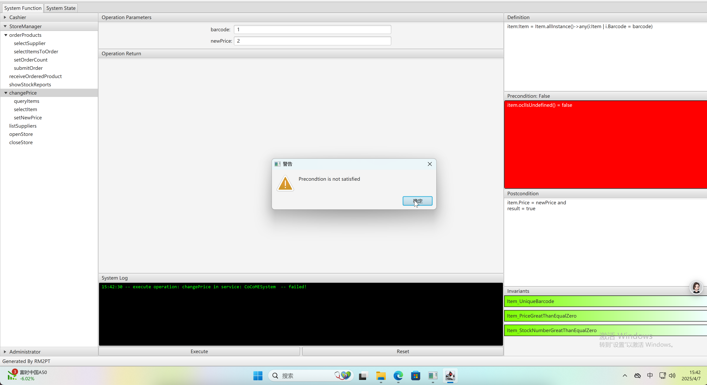

# 软件需求分析与系统设计

## 一、项目选取与准备工作
1、本项目选取在COCOME超时管理系统中扩展
2、安装工具及环境 https://ai4se.com/downloads/
3、阅读作业相关指南：https://ai4se.com/tutorial/user/create_requirements_model/

## 二、结构化自然语言建模
按照项目结构，在RequirementDescription文件夹下新建在xxx.re文件，用结构化的自然语言描述需求。按照角色，用分为了`administrator.re`、`casher.re`、`storManager.re`三个文件，一共`10`条需求用例。

举例管理员的用例， 写了 add catalog 、 manage store 和 manage cashier 三个用例。 其中 add catalog 编写了基本的处理流程，说明了用户和系统分别应该在何时做哪些动作。

## 三、UML需求建模

#### 1、根据结构化的自然语言需求模型，画出对应的用例图

#### 2、为具体用例画出系统时序图

对用例的处理步骤进行拆解，以店铺管理员【向供应商订货】  和 【商品改价】  两个用例为例。

向供应商订货包括

- 选择供应商
- 选择要订货的商品
- 设置要订货的数量
- 提交订单

一共4个主要步骤。 

商品改价包括

- 查询当前在售商品列表
- 选取要改价的商品
- 进行改价

三个主要步骤，其中后两个可以循环进行

#### 3、为系统操作设置OCL合约

OCL合约，写在cocome.remodel文件中，应该放置在**Service**定义的后面。 一个OCL包含 

- 定义：definition ，操作的对象、参数等的定义。
- 前置条件：precondition。 执行操作前各个对象应该满足的条件。
- 后置条件：postcondition。 正确执行完操作后 各个对象应该满足的条件。

3部分组成

#### 4、为领域模型画出类图

下图展示了COCOME系统的概念类图， 蓝色背景的为概念类，包含类目和属性，以及属性的数据类型，绿色背景的为枚举类，包含具体的枚举值。类图还展示了类与类之间的关系。

## 四、UML原型化与需求确认

使用工具自动生成原型系统，并配置maven编译执行该原型。

执行显示库存报告用例成功。

进行改价用例测试，随意输入barcode，提示前置检测失败。

